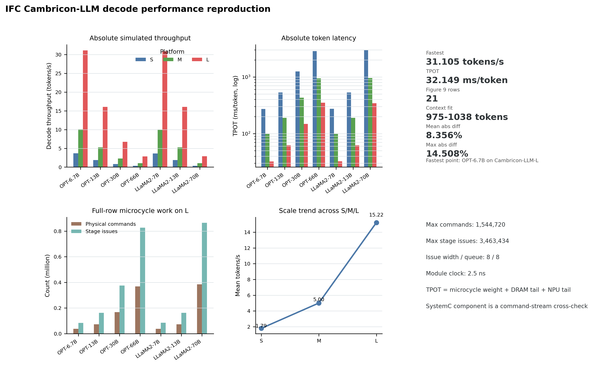
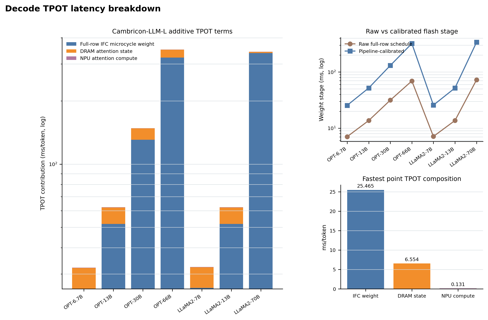
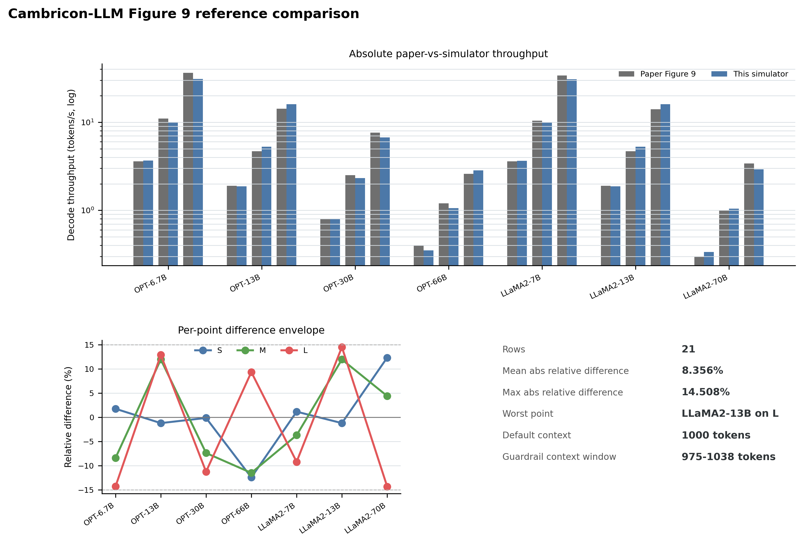
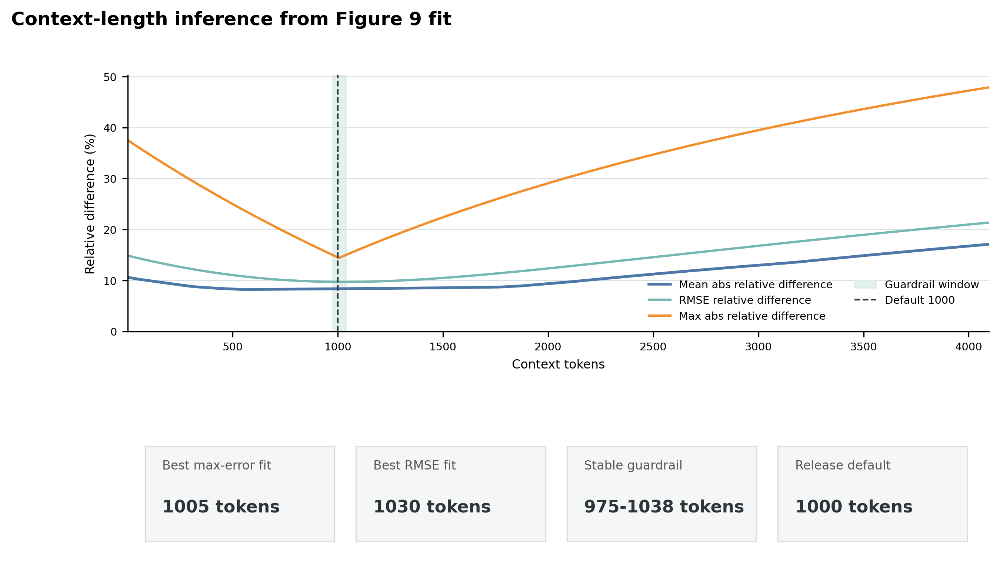
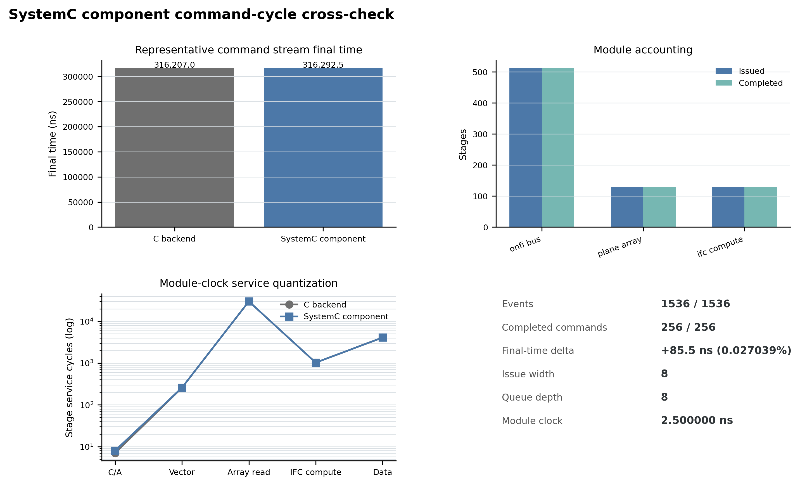
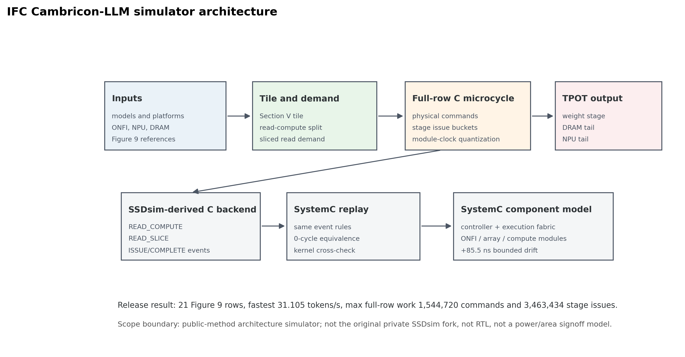

# IFC Cambricon-LLM Simulator

Research-artifact simulator for the Cambricon-LLM in-flash-computing decode path. The project reconstructs the public Figure 9 W8A8 timing method with a standalone C simulator, an SSDsim-derived IFC command backend, and SystemC cross-checks.

Project author and maintainer: **Deng Lishuo (`dengls24`)**

Primary reference paper: [Cambricon-LLM: A Chiplet-Based Hybrid Architecture for On-Device Inference of 70B LLM](https://arxiv.org/abs/2409.15654), MICRO 2024.

## Key Results

| Result | Current value | Artifact |
|---|---:|---|
| Fastest simulated decode speed | 31.105 tokens/s, 32.149 ms/token | `results/figure9_reproduction.csv` |
| Fastest point | OPT-6.7B on Cambricon-LLM-L | `results/figure9_reproduction.csv` |
| LLaMA2-7B on Cambricon-LLM-L | 30.866 tokens/s, 32.399 ms/token | `results/figure9_reproduction.csv` |
| LLaMA2-70B on Cambricon-LLM-L | 2.913 tokens/s, 343.320 ms/token | `results/figure9_reproduction.csv` |
| Figure 9 W8A8 points reproduced | 21 | `results/figure9_reproduction.csv` |
| Inferred Figure 9 context window | 975-1038 tokens; default 1000 tokens | `results/context_length_inference.csv` |
| Full-row IFC microcycle work | up to 1,544,720 physical commands and 3,463,434 stage issues | `results/cycle_weight_timing.csv` |
| Cambricon-LLM-S read-slicing speedup range | 1.724x-1.741x | `results/figure12_read_slice_ablation.csv` |
| Cambricon-LLM-S hardware-aware tiling speedup range | 1.341x-1.349x | `results/figure14_tiling_ablation.csv` |
| SystemC component final-time delta vs C backend | +85.500000 ns, 0.027039% | `results/systemc_component_compare.csv` |

Reference-fit quality is kept as a secondary audit metric in `results/summary.json` (mean absolute relative difference 8.356%, max 14.508%). The main released performance outputs are the absolute decode throughput and TPOT tables below.

The C simulator is the direct paper-facing Figure 9 reproduction path. Its weight-stage TPOT is sourced from a full-row microcycle IFC scheduler for every Figure 9 row, including stage issue-width limiting, issue-queue depth reporting, and module-clock quantization, then combined with the NPU attention tail. The SystemC component model is a command-cycle cross-check for a representative IFC command stream; it is not an independent full Figure 9 simulator and is not RTL.

GitHub release text is prepared in [`docs/github_release.md`](docs/github_release.md). The longer release audit is in [`docs/release_summary.md`](docs/release_summary.md).

## Simulator Variants And Result Ownership

| Variant | Command | Result scope | Released result |
|---|---|---|---|
| Standalone C microcycle simulator plus SSDsim-derived C event backend | `make run` | Full 21-point Cambricon-LLM Figure 9 decode-speed reproduction with per-row IFC microcycle weight timing | Owns all token/s and TPOT tables in this README |
| SystemC replay checker | `make systemc-cycle` | Representative IFC command stream replayed through the SystemC kernel | Lightweight 0-cycle equivalence guard |
| SystemC component command-cycle model | `make systemc-component` | Representative IFC command stream split into controller, execution-fabric, FIFO, ONFI, array, and IFC-compute modules | Detailed C-vs-SystemC comparison: +85.500000 ns final-time delta, 0.027039% |

Read the results this way: the absolute inference-performance numbers are standalone C simulator outputs, and their flash weight stage comes from the full-row microcycle backend in `results/cycle_weight_timing.csv`. The SystemC replay checker is a lightweight equivalence guard. The SystemC component model is the meaningful SystemC result: it compares a componentized command-cycle simulation against the representative C event backend and exposes the small timing drift introduced by FIFO, issue width, and module-clock quantization.

## Experimental Figures



PDF version: [performance_results_dashboard.pdf](docs/figures/performance_results_dashboard.pdf)

The dashboard summarizes the standalone C simulator's absolute decode throughput, TPOT latency, and full 21-point throughput table, then separates the SystemC replay/component checks as validation deltas. Detailed source tables are in `results/figure9_reproduction.csv`, `results/cycle_weight_timing.csv`, `results/figure12_read_slice_ablation.csv`, `results/figure14_tiling_ablation.csv`, and `results/systemc_component_compare.csv`.



PDF version: [decode_latency_breakdown.pdf](docs/figures/decode_latency_breakdown.pdf)

The latency breakdown figure decomposes standalone C decode TPOT into the microcycle-derived flash-weight stage, attention state memory, and attention score/value compute. It also shows the raw full-row IFC microcycle weight timing before platform pipeline calibration.



PDF version: [paper_reference_comparison.pdf](docs/figures/paper_reference_comparison.pdf)

The paper-reference comparison reports absolute paper-vs-simulator decode throughput for all 21 Figure 9 W8A8 points, plus compact delta and platform-level reproduction summaries.



PDF version: [context_length_inference.pdf](docs/figures/context_length_inference.pdf)

The context-length inference figure treats decode context length as a sweep parameter and fits the public Figure 9 throughput references. The stable paper-fit window is 975-1038 tokens; the default 1000-token context is inside that window, while the best RMSE and best max-error points are 1030 and 1005 tokens respectively. This is an inferred reproduction setting, not a claim that the paper text explicitly states the Figure 9 context length.



PDF version: [systemc_component_comparison.pdf](docs/figures/systemc_component_comparison.pdf)

The SystemC component figure gives the detailed comparison that the replay checker cannot provide: final command-stream time, per-stage service-time quantization, matched-event timing drift, and module issued/completed accounting. The C path remains the paper-facing throughput simulator; the component SystemC path is a detailed command-cycle validation model.

## Standalone C Absolute Inference Performance

Decode throughput is reported as simulated tokens/s from the standalone C paper-facing path for one output token at the inferred 1K context under the default paper profile.

| Model | Cambricon-LLM-S | Cambricon-LLM-M | Cambricon-LLM-L |
|---|---:|---:|---:|
| OPT-6.7B | 3.663151 | 10.073148 | 31.104766 |
| OPT-13B | 1.876975 | 5.261630 | 16.031076 |
| OPT-30B | 0.798864 | 2.315097 | 6.743696 |
| OPT-66B | 0.350199 | 1.061912 | 2.842984 |
| LLaMA2-7B | 3.641585 | 10.013449 | 30.865517 |
| LLaMA2-13B | 1.876975 | 5.261630 | 16.031076 |
| LLaMA2-70B | 0.337002 | 1.043976 | 2.912732 |

TPOT latency is reported as simulated ms/token for the same standalone C runs.

| Model | Cambricon-LLM-S | Cambricon-LLM-M | Cambricon-LLM-L |
|---|---:|---:|---:|
| OPT-6.7B | 272.989 | 99.274 | 32.149 |
| OPT-13B | 532.772 | 190.055 | 62.379 |
| OPT-30B | 1251.778 | 431.947 | 148.287 |
| OPT-66B | 2855.518 | 941.697 | 351.743 |
| LLaMA2-7B | 274.606 | 99.866 | 32.399 |
| LLaMA2-13B | 532.772 | 190.055 | 62.379 |
| LLaMA2-70B | 2967.342 | 957.876 | 343.320 |

TPOT is computed as `weight_stage_ms + attention_cache_ms + attention_compute_ms`. In the default release path, `weight_stage_ms` is copied from `cycle_weight_stage_ms`, the calibrated full-row IFC microcycle schedule in `results/cycle_weight_timing.csv`; the analytic overlap path is retained only as a fallback and ablation reference. `make test` checks this equality for every Figure 9 row.

## Architecture



PDF version: [architecture_summary.pdf](docs/figures/architecture_summary.pdf)

## What This Repository Contains

- C timing simulator for Cambricon-LLM Figure 9 decode-speed reproduction.
- Runtime-configurable model, flash platform, NPU/DRAM, ONFI bandwidth, and IFC compute profiles.
- Full-row microcycle-derived IFC weight-stage timing for every Figure 9 row.
- SSDsim-derived C event backend for the extended IFC commands `READ_COMPUTE` and `READ_SLICE`.
- Dependency-free C++ hardware-cycle checker.
- SystemC replay checker that proves exact event equivalence with the C backend.
- Component-level SystemC command-cycle model with controller/execution-fabric modules, finite issue FIFO, issue-width limit, module-clock quantization, and VCD output.
- CSV/JSON/Markdown/PNG/PDF result artifacts for paper comparison, breakdowns, ablations, and validation.

## Language Breakdown

Implementation-source mix, measured with `wc -l` over `src/*.c`, `include/*.h`, `tests/*.c`, `systemc/*.cpp`, `tools/*.sh`, and `Makefile`. Documentation and generated result artifacts are excluded from this table.

| Language / file type | Files | Source lines | Share |
|---|---:|---:|---:|
| C / C header / C tests | 10 | 4,585 | 71.9% |
| C++ / SystemC | 3 | 1,677 | 26.3% |
| Makefile | 1 | 92 | 1.4% |
| Shell | 1 | 22 | 0.3% |
| Total | 15 | 6,376 | 100.0% |

## Quick Start

```bash
make run
```

Expected summary:

```text
passed: Cambricon-LLM Figure 9 C reproduction
rows: 21
mean_abs_relative_error_pct: 8.356
max_abs_relative_error_pct: 14.508
```

Run the C test suite:

```bash
make test
```

Run all local checks, including SystemC paths when `libsystemc` is available:

```bash
make test-all
```

## SystemC Setup

The default SystemC path is:

```bash
SYSTEMC_HOME=../.ifc_systemc/systemc_sysroot/usr
```

If SystemC is not installed system-wide, install a local copy without root privileges:

```bash
tools/setup_systemc_local.sh
```

Run the SystemC replay/equivalence checker:

```bash
make systemc-cycle
```

Run the SystemC component-level command-cycle model:

```bash
make systemc-component
```

Run all C, C++, and SystemC validation paths:

```bash
make systemc-full
```

## Reproduction Outputs

Main paper-facing outputs:

- `results/figure9_reproduction.csv`
- `results/summary.json`
- `results/report.md`
- `results/latency_breakdown.csv`
- `results/cycle_weight_timing.csv`
- `results/controller_timing_summary.csv`
- `results/npu_timing.csv`
- `results/context_length_inference.csv`
- `results/simulator_scheme_comparison.csv`
- `docs/figures/performance_results_dashboard.png`
- `docs/figures/performance_results_dashboard.pdf`
- `docs/figures/decode_latency_breakdown.png`
- `docs/figures/decode_latency_breakdown.pdf`
- `docs/figures/paper_reference_comparison.png`
- `docs/figures/paper_reference_comparison.pdf`
- `docs/figures/context_length_inference.png`
- `docs/figures/context_length_inference.pdf`
- `docs/figures/systemc_component_comparison.png`
- `docs/figures/systemc_component_comparison.pdf`
- `docs/figures/architecture_summary.png`
- `docs/figures/architecture_summary.pdf`

Controller and IFC command-path audit outputs:

- `results/controller_schedule.csv`
- `results/cycle_controller_trace.csv`
- `results/cycle_controller_stats.csv`
- `results/ssdsim_ifc_trace.csv`
- `results/ssdsim_ifc_stats.csv`
- `results/ssdsim_ifc_event_trace.csv`
- `results/ssdsim_ifc_event_stats.csv`

SystemC outputs:

- `results/systemc_cycle_trace.csv`
- `results/systemc_cycle_stats.csv`
- `results/systemc_cycle_compare.csv`
- `results/systemc_component_trace.csv`
- `results/systemc_component_stats.csv`
- `results/systemc_component_compare.csv`
- `results/systemc_component_modules.csv`
- `results/systemc_component.vcd`

## Method Summary

The simulator follows the public Cambricon-LLM method path:

1. Load Cambricon-LLM-S/M/L flash profiles, model profiles, NPU/DRAM profile, and Figure 9 references.
2. Derive the hardware-aware tile shape from the Section V formulation:

   ```text
   H_req = sqrt(cores_per_channel * page_size)
   W_req = channel_count * H_req
   ```

3. Compute logical read-compute and sliced-read demand, expand it into physical channel/chip/die commands, and schedule the full-row IFC weight stage with integer controller cycles for C/A, vector transfer, data transfer, array read, and IFC compute.
4. Add the NPU attention compute path and DRAM attention-cache path.
5. Sweep context length for inverse Figure 9 fit and keep the inferred 1K setting as the default reproduction context.
6. Emit token/s, TPOT, breakdowns, ablations, traces, and cross-checks.

For Cambricon-LLM-S, the derived tile is `256 x 2048`, matching the paper's tile-size study.

## Configurable Experiments

The default run uses the built-in paper profile. Design-space runs can override flash scale, ONFI bandwidth, IFC frequency/throughput, NPU frequency/throughput, DRAM bandwidth, context length, and model parameters:

```bash
make all
bin/ifc_cambricon_llm \
  --output-dir results_scaled \
  --models-csv configs/example_models_mixed.csv \
  --platforms-csv configs/example_scaled_platforms.csv \
  --system-csv configs/example_system_fast_npu.csv \
  --reference-csv configs/default_references.csv
```

When custom hardware or model profiles are used with default references, token/s values are design-space estimates. Relative-error metrics are reproduction claims only when the reference CSV matches the configured setup.

## Documentation Map

| Topic | Document |
|---|---|
| Method and timing model | `docs/method.md`, `docs/latency_model.md` |
| Controller and SSDsim-derived backend | `docs/controller_cycle_model.md`, `docs/ssdsim_ifc_backend.md` |
| Configuration | `docs/configuration.md` |
| Results and release summary | `docs/results.md`, `docs/release_summary.md` |
| C/SystemC paper comparison | `docs/paper_comparison.md` |
| Reliability and modeling boundaries | `docs/simulator_reliability.md` |
| References and BibTeX | `docs/references.md`, `data/references.bib` |
| SystemC models | `systemc/README.md` |

## Repository Layout

```text
configs/     Runtime CSV examples for model, platform, system, and reference profiles
data/        Paper profile data and BibTeX references
docs/        Method notes, release notes, reliability notes, and PNG/PDF figures
include/     Public C header
src/         C simulator, controller, SSDsim-derived backend, analysis, and result plots
systemc/     C++ hardware-cycle checker, SystemC replay checker, component SystemC model
tests/       C smoke tests and reproduction-bound checks
tools/       Local SystemC setup helper
results/     Checked reproduction outputs, traces, comparisons, and figures
```

## Authors And Citation

Project author and maintainer:

- Deng Lishuo (`dengls24`)

Reference paper:

- Zhongkai Yu et al., "Cambricon-LLM: A Chiplet-Based Hybrid Architecture for On-Device Inference of 70B LLM," MICRO 2024, arXiv:2409.15654.

See `AUTHORS.md`, `CITATION.cff`, `docs/references.md`, and `data/references.bib`.

## Scope Boundary

This repository should be described as a public-method architecture simulator and audit artifact. It should not be described as:

- the original Cambricon-LLM SSDsim fork;
- a full SSD firmware simulator;
- an RTL implementation;
- a power/area/signoff model;
- a complete prefill, multi-batch, or full serving-system simulator.
