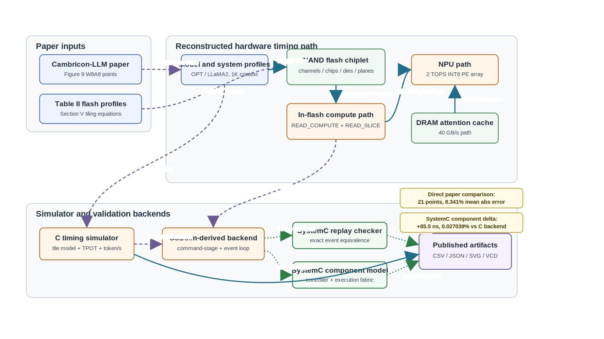

# IFC Cambricon-LLM Simulator

Research-artifact simulator for the Cambricon-LLM in-flash-computing decode path. The project reconstructs the public Figure 9 W8A8 timing method with a standalone C simulator, an SSDsim-derived IFC command backend, and SystemC cross-checks.

Project author and maintainer: **Deng Lishuo (`dengls24`)**

Primary reference paper: [Cambricon-LLM: A Chiplet-Based Hybrid Architecture for On-Device Inference of 70B LLM](https://arxiv.org/abs/2409.15654), MICRO 2024.

## Key Results

| Result | Current value | Artifact |
|---|---:|---|
| Figure 9 W8A8 points reproduced | 21 | `results/figure9_reproduction.csv` |
| Mean absolute relative error | 8.341% | `results/summary.json` |
| Max absolute relative error | 14.618% | `results/summary.json` |
| Worst case | LLaMA2-70B on Cambricon-LLM-L | `results/summary.json` |
| Read-slicing speedup range | 1.683x-1.699x | `results/figure12_read_slice_ablation.csv` |
| Hardware-aware tiling speedup range | 1.341x-1.349x | `results/figure14_tiling_ablation.csv` |
| SystemC replay delta vs C event backend | 0 cycles | `results/systemc_cycle_compare.csv` |
| SystemC component final-time delta vs C backend | +85.500000 ns, 0.027039% | `results/systemc_component_compare.csv` |

The C simulator is the direct paper-facing Figure 9 reproduction path. The SystemC component model is a command-cycle cross-check for a representative IFC command stream; it is not an independent full Figure 9 simulator and is not RTL.

## Architecture



Editable figure spec: `docs/figures/ifc_cambricon_llm_architecture_spec.json`.

## What This Repository Contains

- C timing simulator for Cambricon-LLM Figure 9 decode-speed reproduction.
- Runtime-configurable model, flash platform, NPU/DRAM, ONFI bandwidth, and IFC compute profiles.
- SSDsim-derived C event backend for the extended IFC commands `READ_COMPUTE` and `READ_SLICE`.
- Dependency-free C++ hardware-cycle checker.
- SystemC replay checker that proves exact event equivalence with the C backend.
- Component-level SystemC command-cycle model with controller/execution-fabric modules, finite issue FIFO, issue-width limit, module-clock quantization, and VCD output.
- CSV/JSON/Markdown/SVG result artifacts for paper comparison, breakdowns, ablations, and validation.

## Language Breakdown

Implementation-source mix, measured with `wc -l` over `src/*.c`, `include/*.h`, `tests/*.c`, `systemc/*.cpp`, `tools/*.sh`, and `Makefile`. Documentation and generated result artifacts are excluded from this table.

| Language / file type | Files | Source lines | Share |
|---|---:|---:|---:|
| C / C header / C tests | 10 | 3,915 | 68.6% |
| C++ / SystemC | 3 | 1,677 | 29.4% |
| Makefile | 1 | 92 | 1.6% |
| Shell | 1 | 22 | 0.4% |
| Total | 15 | 5,708 | 100.0% |

## Quick Start

```bash
make run
```

Expected summary:

```text
passed: Cambricon-LLM Figure 9 C reproduction
rows: 21
mean_abs_relative_error_pct: 8.341
max_abs_relative_error_pct: 14.618
```

Run the C test suite:

```bash
make test
```

Run all local checks, including SystemC paths when `libsystemc` is available:

```bash
make test-all
```

## SystemC Setup

The default SystemC path is:

```bash
SYSTEMC_HOME=../.ifc_systemc/systemc_sysroot/usr
```

If SystemC is not installed system-wide, install a local copy without root privileges:

```bash
tools/setup_systemc_local.sh
```

Run the replay/equivalence checker:

```bash
make systemc-cycle
```

Run the component-level command-cycle model:

```bash
make systemc-component
```

Run all C, C++, and SystemC validation paths:

```bash
make systemc-full
```

## Reproduction Outputs

Main paper-facing outputs:

- `results/figure9_reproduction.csv`
- `results/summary.json`
- `results/report.md`
- `results/latency_breakdown.csv`
- `results/controller_timing_summary.csv`
- `results/npu_timing.csv`
- `results/simulator_scheme_comparison.csv`
- `results/figures/figure9_decode_speed.svg`
- `results/figures/figure9_relative_error.svg`

Controller and IFC command-path audit outputs:

- `results/controller_schedule.csv`
- `results/cycle_controller_trace.csv`
- `results/cycle_controller_stats.csv`
- `results/ssdsim_ifc_trace.csv`
- `results/ssdsim_ifc_stats.csv`
- `results/ssdsim_ifc_event_trace.csv`
- `results/ssdsim_ifc_event_stats.csv`

SystemC outputs:

- `results/systemc_cycle_trace.csv`
- `results/systemc_cycle_stats.csv`
- `results/systemc_cycle_compare.csv`
- `results/systemc_component_trace.csv`
- `results/systemc_component_stats.csv`
- `results/systemc_component_compare.csv`
- `results/systemc_component_modules.csv`
- `results/systemc_component.vcd`

## Method Summary

The simulator follows the public Cambricon-LLM method path:

1. Load Cambricon-LLM-S/M/L flash profiles, model profiles, NPU/DRAM profile, and Figure 9 references.
2. Derive the hardware-aware tile shape from the Section V formulation:

   ```text
   H_req = sqrt(cores_per_channel * page_size)
   W_req = channel_count * H_req
   ```

3. Compute the IFC tiled weight stage using flash array-read latency, ONFI transfer time, input-vector transfer time, and read-compute/read-request balance.
4. Add the NPU attention compute path and DRAM attention-cache path.
5. Emit token/s, TPOT, breakdowns, ablations, traces, and cross-checks.

For Cambricon-LLM-S, the derived tile is `256 x 2048`, matching the paper's tile-size study.

## Configurable Experiments

The default run uses the built-in paper profile. Design-space runs can override flash scale, ONFI bandwidth, IFC frequency/throughput, NPU frequency/throughput, DRAM bandwidth, context length, and model parameters:

```bash
make all
bin/ifc_cambricon_llm \
  --output-dir results_scaled \
  --models-csv configs/example_models_mixed.csv \
  --platforms-csv configs/example_scaled_platforms.csv \
  --system-csv configs/example_system_fast_npu.csv \
  --reference-csv configs/default_references.csv
```

When custom hardware or model profiles are used with default references, token/s values are design-space estimates. Relative-error metrics are reproduction claims only when the reference CSV matches the configured setup.

## Documentation Map

| Topic | Document |
|---|---|
| Method and timing model | `docs/method.md`, `docs/latency_model.md` |
| Controller and SSDsim-derived backend | `docs/controller_cycle_model.md`, `docs/ssdsim_ifc_backend.md` |
| Configuration | `docs/configuration.md` |
| Results and release summary | `docs/results.md`, `docs/release_summary.md` |
| C/SystemC paper comparison | `docs/paper_comparison.md` |
| Reliability and modeling boundaries | `docs/simulator_reliability.md` |
| References and BibTeX | `docs/references.md`, `data/references.bib` |
| SystemC models | `systemc/README.md` |

## Repository Layout

```text
configs/     Runtime CSV examples for model, platform, system, and reference profiles
data/        Paper profile data and BibTeX references
docs/        Method notes, release notes, reliability notes, and architecture SVG
include/     Public C header
src/         C simulator, controller, SSDsim-derived backend, analysis, and SVG plots
systemc/     C++ hardware-cycle checker, SystemC replay checker, component SystemC model
tests/       C smoke tests and reproduction-bound checks
tools/       Local SystemC setup helper
results/     Checked reproduction outputs, traces, comparisons, and figures
```

## Authors And Citation

Project author and maintainer:

- Deng Lishuo (`dengls24`)

Reference paper:

- Zhongkai Yu et al., "Cambricon-LLM: A Chiplet-Based Hybrid Architecture for On-Device Inference of 70B LLM," MICRO 2024, arXiv:2409.15654.

See `AUTHORS.md`, `CITATION.cff`, `docs/references.md`, and `data/references.bib`.

## Scope Boundary

This repository should be described as a public-method architecture simulator and audit artifact. It should not be described as:

- the original Cambricon-LLM SSDsim fork;
- a full SSD firmware simulator;
- an RTL implementation;
- a power/area/signoff model;
- a complete prefill, multi-batch, or full serving-system simulator.
